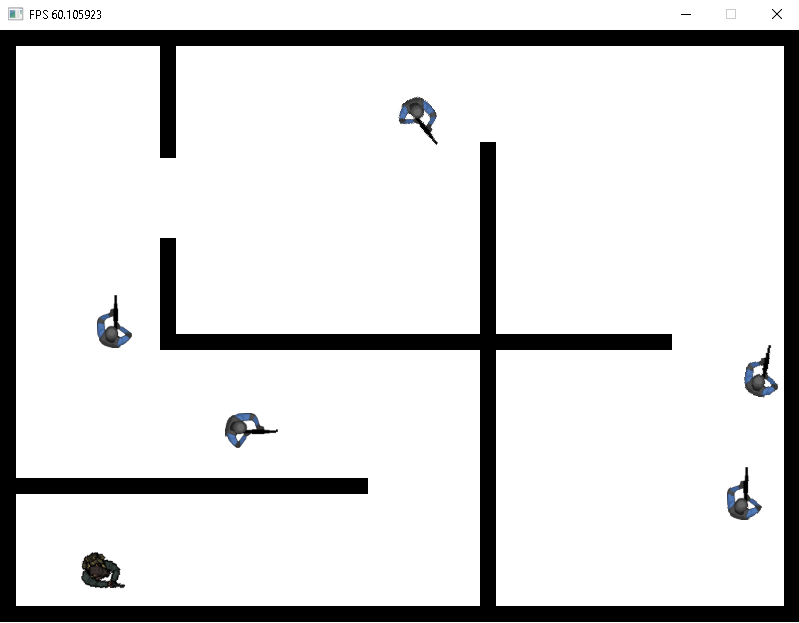

# SDL_BSM
Game prototype developed as part of a gamedev postgraduation course in 2018.

# Tech
* C++
* SDL2-2.0.7 - https://www.libsdl.org/
* Lua - https://www.lua.org/
* Tiled - https://www.mapeditor.org/

# Gameplay video

