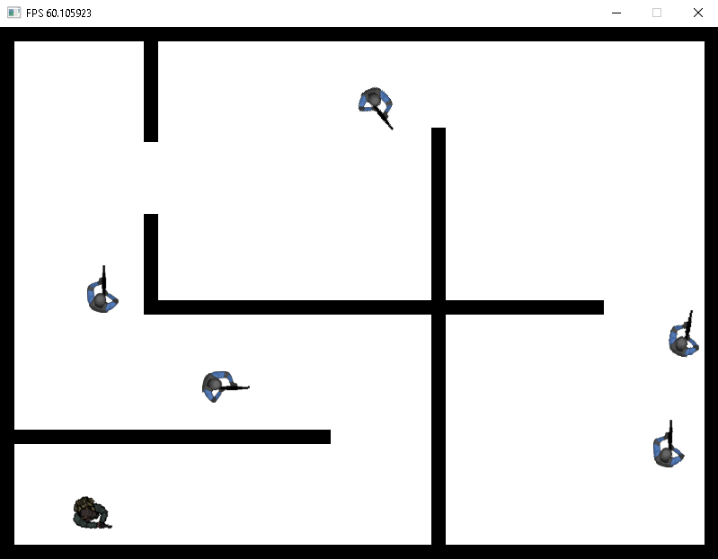
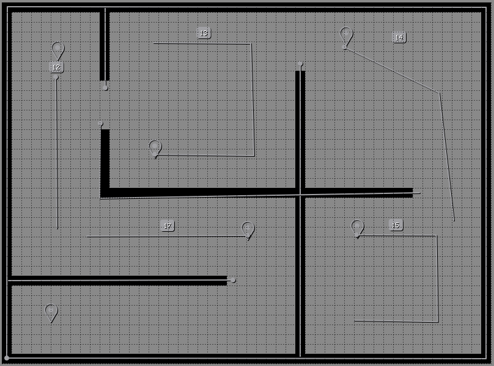
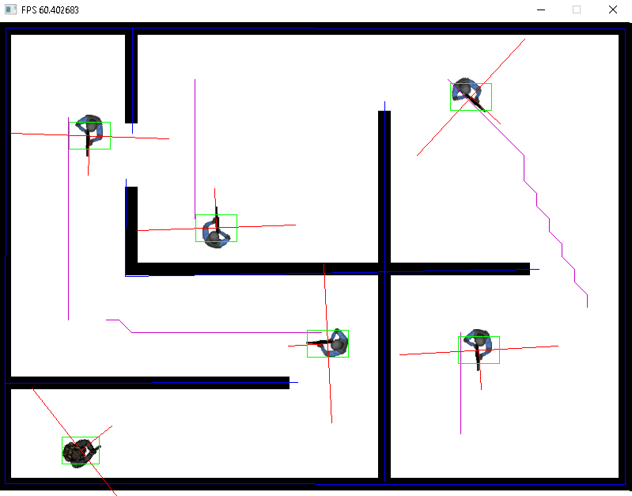
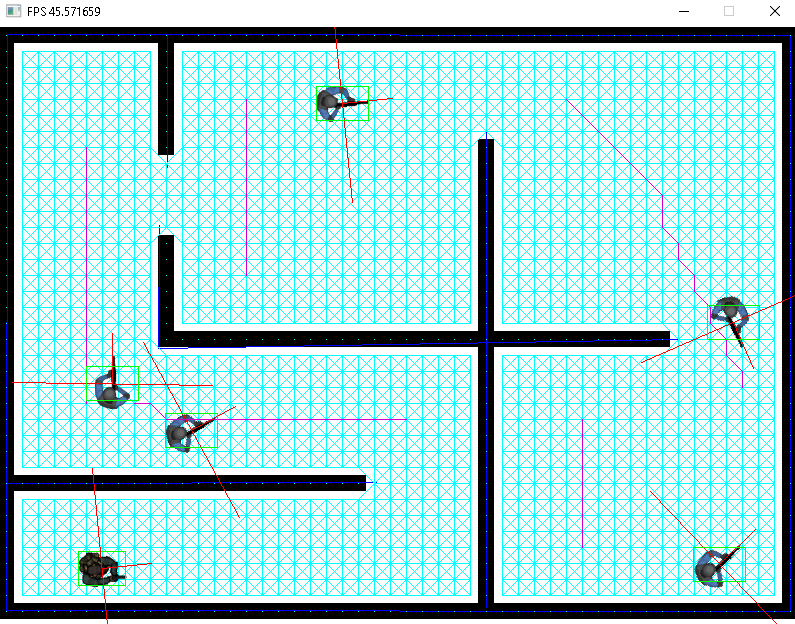

# SDL_BSM

It is a minimalist top-down-shooter game prototype developed for a gamedev postgraduation course in 2018.
The main focus of the project was in the coding part.
The game consists of eliminating all the enemies without been seen by them.

# Tech

* C++
* SDL2-2.0.7 - https://www.libsdl.org/
* Lua - https://www.lua.org/
* Tiled - https://www.mapeditor.org/

# Gameplay video

# Level Design

To design the levels I used a tool named Tiled that provided some tools that I used to define the following objects:

* Walls
* Player initial position
* Enemies initial position
* Enemies patrol route

Then when the level was ready I exported .lua file to be loaded and parsed by the game.

Below a level design inside Tiled:

[]

Then the same level loaded in the game (in debug mode)

[]

In blue the walls used by the line of sight (LOS) system.
In green the box colliders.
In purple the enemy patrol route.
In red the direction and field of view (FOV).

# Pathfinding

To move the enemies through the level I used the A* algorithm to navigate on a navgraph. 
The navgraph is created based on level data loaded from the .lua file.

Below a sample of the level with the navgraph highlighted in light blue:

[]

# Finite State Machine and Steering Behaviors

To define the enemies' actions I implemented an FSM with the following states:

* Global (a special state that is always executed)
* Idle
* Patrol
* Chase
* Attack
* Dying
* Dead

Then to move the enemies based on the action set to the FSM I implemented some steering behaviors:

* seek
* arrive
* follow path
* wall avoidance (not used yet)

# Messaging

The game objects communicate with each other using a messaging system.
